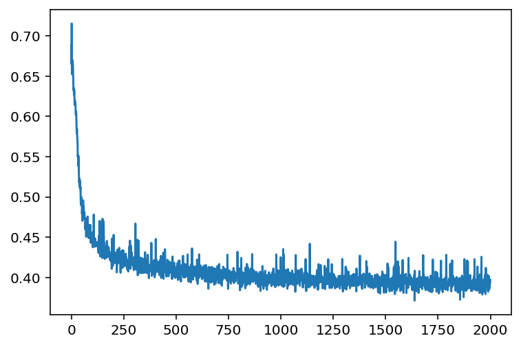

# Link Prediction with the Yeast Interactome
This code takes the yeast interactome dataset from the CCSB Interactome Database and runs a link prediction model that tries to predict the existence of negative and positive interactions between the different nodes

Link to Source: https://interactome.dfci.harvard.edu/S_cerevisiae/download/CCSB-Y2H.txt

Loss Plot:

